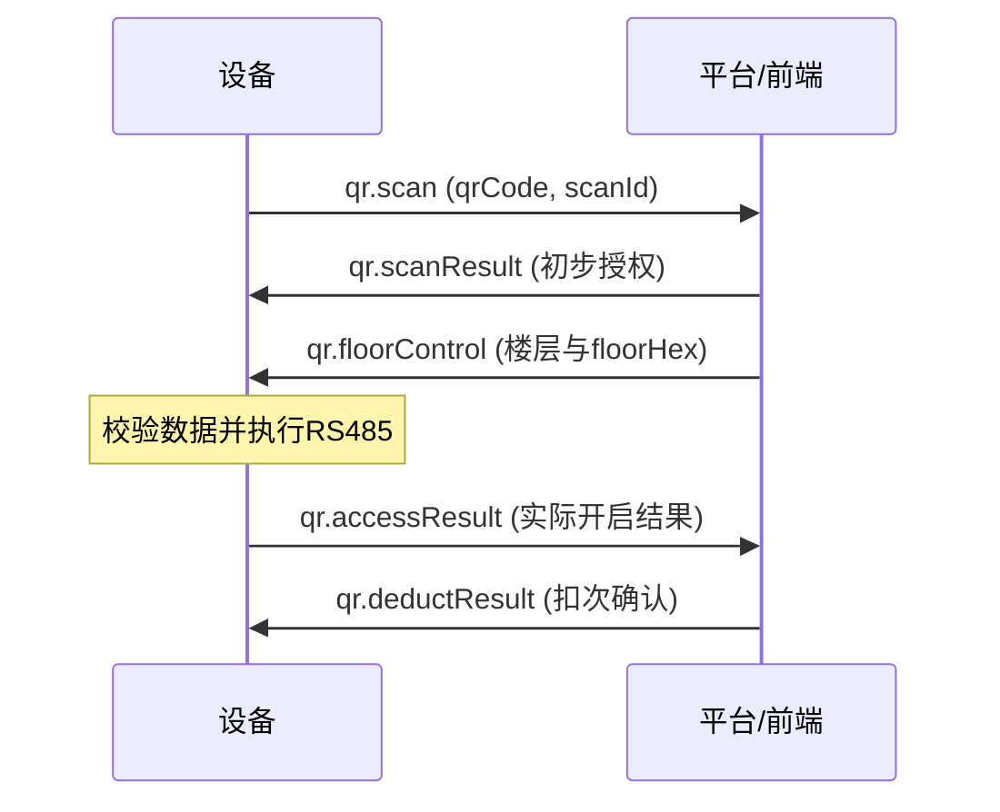

# online_v1 MQTT 前端对接接口说明

> 工程：MergedQtApp（RK3566 / Qt 5.12.8）  
> 文档日期：2026-08-12  
> 分析方式：基于当前源码静态分析，未修改任何业务代码，未连接真实 Broker 或目标板验证  
> 适用范围：`feature/online_v1=true` 的 ycLinux V1 MQTT 路由

## 1. 对接结论

online_v1 使用“一条下行主题 + 一条上行主题”，以 JSON `method` 区分业务：

| 方向 | Topic | 说明 |
|---|---|---|
| 平台/前端 → 设备 | `device/ycLinux/{deviceId}/request` | 设备订阅；所有平台指令发到此处 |
| 设备 → 平台/前端 | `device/ycLinux/{deviceId}/event` | 设备发布；所有响应、状态和主动事件发到此处 |

`{deviceId}` 就是 MQTT `client_id`。当前设备自动生成规则为：读取设备序列号，计算带盐 SHA-256，取前 10 位大写十六进制，并加前缀 `YCEEQZ`，例如 `YCEEQZA10C1FFC62`。前端不应自行推算，应使用设备注册信息或实际 Topic 中的值。

当前代码默认 MQTT 端口为 `1883`、keepalive 为 `30s`、QoS 为 `0`、TLS 为关闭；这些均是部署配置，不是业务协议常量。业务 JSON 直接作为 MQTT Payload 发布，本文示例不包含设备内部 mqttd IPC 的 `{"cmd":"publish",...}` 包装。

## 2. 公共报文约定

### 2.1 标准信封

```json
{
  "method": "业务方法名",
  "id": "消息唯一ID",
  "deviceId": "YCEEQZA10C1FFC62",
  "data": {},
  "time": "2026-08-12 14:30:00"
}
```

| 字段 | 类型 | 对接要求 |
|---|---|---|
| `method` | string | 区分大小写，必须使用本文列出的准确拼写 |
| `id` | string | 请求/消息唯一 ID；有回执的接口通常原样返回，用作前端关联键 |
| `deviceId` | string | 应与 Topic 中的 `{deviceId}` 及设备当前 `client_id` 一致 |
| `data` | object | 业务字段；无参数时建议发送 `{}` |
| `time` | string | 格式 `yyyy-MM-dd HH:mm:ss`；设备上行均使用此格式 |

注意：

- online_v1 应统一使用 `method` 和小写 `time`，不要使用旧 IC 协议的 `methon`、`Time`。
- 当前通用媒体处理器不会统一校验 `deviceId`；二维码和 `remoteCall` 会严格校验。前端仍应始终发送正确的 `deviceId`。
- 人员同步按 `(deviceId, id)` 做幂等。同一 ID、同一内容会返回缓存结果并增加 `data.duplicate=true`；同一 ID 对应不同内容会返回 `MESSAGE_ID_CONFLICT`。
- MQTT 已提交不等于硬件动作一定成功；应以对应业务回执为准。明确无回执的接口见第 4 节。

### 2.2 接口总览

| method | 方向 | 设备是否回消息 | 说明 |
|---|---|---:|---|
| `getPlayFileList` | 下行 | 是：`sendPlayFileList` | 查询本地视频列表 |
| `getPlayInfo` | 下行 | 是：`sendPlayInfo` | 查询当前播放状态与截图 |
| `deletePlayFile` | 下行 | **否** | 删除本地视频 |
| `videoControl` | 下行/上行 | 是：同 method | 控制直播、录播、停止、音量；也用于本地音量主动同步 |
| `linuxReboot` | 下行 | 是：同 method | 回执后约 1 秒重启设备 |
| `sync.fullPersonnel` | 下行 | 是：同 method | 全量新增/更新一个人员 |
| `sync.checkAllPersonHash` | 下行 | 是：同 method | 平台全量人员 hash 对账 |
| `sync.deletePersonnel` | 下行 | 是：同 method | 删除人员或指定凭证 |
| `face.requestImages` | 上行 | — | 设备主动索取缺失的人脸原图 |
| `face.responseImages` | 下行 | 是：`Imagesresult` | 平台下发人脸 Base64 原图 |
| `face.accessResult` | 上行 | 异步 `face.deductResult` | 本地人脸识别控梯实际结果 |
| `card.accessResult` | 上行 | 异步 `card.deductResult` | 本地刷卡控梯实际结果 |
| `face.deductResult` / `card.deductResult` | 下行 | **否** | 平台确认人脸/刷卡扣次并同步本地计数 |
| `remoteCall` | 下行 | 异步 `remoteCall.accessResult` | 远程单楼层呼梯 |
| `remoteCall.accessResult` | 上行 | 异步 `remoteCall.deductResult` | 设备报告 RS485 实际执行结果 |
| `remoteCall.deductResult` | 下行 | **否** | 平台确认远程呼梯扣次并同步本地计数 |
| `qr.scan` | 上行 | — | 设备报告扫码值，开始二维码事务 |
| `qr.scanResult` | 下行 | 无直接回执 | 平台返回初步校验结果 |
| `qr.floorControl` | 下行 | 异步 `qr.accessResult` | 平台下发楼层控制数据 |
| `qr.accessResult` | 上行 | — | 设备报告 RS485 实际执行结果 |
| `qr.deductResult` | 下行 | **否** | 平台返回扣次结果并结束事务 |

## 3. 多媒体与系统接口

### 3.1 查询本地视频列表

下行 `getPlayFileList`：

```json
{
  "method": "getPlayFileList",
  "id": "play-list-001",
  "deviceId": "YCEEQZA10C1FFC62",
  "data": {},
  "time": "2026-08-12 14:30:00"
}
```

上行 `sendPlayFileList`：

```json
{
  "method": "sendPlayFileList",
  "id": "play-list-001",
  "deviceId": "YCEEQZA10C1FFC62",
  "data": {
    "file": [
      { "id": 1, "name": "welcome" },
      { "id": 2, "name": "notice" }
    ]
  },
  "time": "2026-08-12 14:30:01"
}
```

`name` 是不带扩展名的文件基本名；`id` 是按本次目录扫描结果从 1 临时编号，不是稳定资源 ID。设备扫描的扩展名为 `mp4/avi/mov/mkv/ts/flv/m4v`。

### 3.2 查询当前播放信息

下行 `getPlayInfo` 与 3.1 的请求信封相同，仅替换 `method`。设备收到后先请求界面截图，截图回调完成后才发布：

```json
{
  "method": "sendPlayInfo",
  "id": "play-info-001",
  "deviceId": "YCEEQZA10C1FFC62",
  "data": {
    "info": {
      "videoType": "recorded",
      "videoVolume": 50,
      "videoPath": "welcome.mp4",
      "videoUrl": "",
      "name": "welcome",
      "base64Image": "...",
      "deviceLog": ""
    }
  },
  "time": "2026-08-12 14:30:01"
}
```

| 字段 | 类型 | 说明 |
|---|---|---|
| `videoType` | string | `none` / `live` / `recorded`，响应为小写 |
| `videoVolume` | integer | 当前音量，0–100 |
| `videoPath` | string | 当前录播文件名 |
| `videoUrl` | string | 仅 `live` 时返回 URL，其他类型为空 |
| `name` | string | 当前资源显示名 |
| `base64Image` | string | 当前画面截图 Base64；代码未固定是否带 data URL 前缀 |
| `deviceLog` | string | 最近的播放、音量、下载状态或错误说明 |

当前实现没有截图等待超时回包；如果界面没有产生截图回调，前端可能收不到 `sendPlayInfo`，应设置业务超时。

### 3.3 删除本地视频

```json
{
  "method": "deletePlayFile",
  "id": "delete-001",
  "deviceId": "YCEEQZA10C1FFC62",
  "data": {
    "name": "welcome",
    "id": "1"
  },
  "time": "2026-08-12 14:30:00"
}
```

- 实际只使用 `data.name`，按不带扩展名的文件基本名匹配；`data.id` 仅记录日志。
- 当前实现无 MQTT 成功/失败回执。前端需要确认时，可随后调用 `getPlayFileList` 验证。

### 3.4 播放与音量控制 `videoControl`

通用请求字段：

| `data` 字段 | 类型 | 说明 |
|---|---|---|
| `videoType` | string | `LIVE` / `RECORDED` / `NONE`；请求建议大写 |
| `videoVolume` | integer/string | 可选；会转换为整数并限制到 0–100 |
| `videoUrl` | string | LIVE 必填 |
| `videoPath` | string | RECORDED 下载时必填；设备仅取文件名，目录部分会被移除 |
| `ftpPath` | string | RECORDED 下载的 FTP 主机 |
| `ftpPort` | string | RECORDED 下载的 FTP 端口；当前代码按字符串读取 |
| `ftpUser` | string | FTP 用户名 |
| `ftpPwd` | string | FTP 密码；字符串 `null` 会被当作空密码 |

LIVE 示例：

```json
{
  "method": "videoControl",
  "id": "video-001",
  "deviceId": "YCEEQZA10C1FFC62",
  "data": {
    "videoType": "LIVE",
    "videoVolume": 60,
    "videoUrl": "rtsp://192.168.1.10/live"
  },
  "time": "2026-08-12 14:30:00"
}
```

RECORDED 下载示例：

```json
{
  "method": "videoControl",
  "id": "video-002",
  "deviceId": "YCEEQZA10C1FFC62",
  "data": {
    "videoType": "RECORDED",
    "videoVolume": 50,
    "videoPath": "welcome.mp4",
    "ftpPath": "192.168.1.20",
    "ftpPort": "21",
    "ftpUser": "media",
    "ftpPwd": "secret"
  },
  "time": "2026-08-12 14:31:00"
}
```

控制回执仍为 `videoControl`，沿用请求 `id/deviceId`，保留原 `data` 后按场景补充：

```json
{
  "method": "videoControl",
  "id": "video-002",
  "deviceId": "YCEEQZA10C1FFC62",
  "data": {
    "videoType": "RECORDED",
    "videoVolume": 50,
    "videoPath": "welcome.mp4",
    "ftpPath": "192.168.1.20",
    "ftpPort": "21",
    "ftpUser": "media",
    "ftpPwd": "secret",
    "status": "ok",
    "deviceClientIp": "192.168.1.100",
    "ftpDownload": "100%",
    "downloadResult": "downloaded",
    "reason": "FTP download completed"
  },
  "time": "2026-08-12 14:31:08"
}
```

| 回执字段 | 可能值/说明 |
|---|---|
| `status` | `ok` / `error`；部分“切回已有录播”场景代码可省略 |
| `deviceClientIp` | 当前设备 IP |
| `ftpDownload` | `100%` / `0%`；不是连续进度值，部分场景省略 |
| `downloadResult` | `downloaded`、`already_exists`、`retryable_error`、`local_rejected`、`storage_limited`、`setup_error`、`download_busy` |
| `reason` | 人类可读原因，可省略 |

行为约定：

- `LIVE`：要求 `videoUrl` 非空；支持识别 RTSP、RTMP(S)、SRT、UDP、HLS 和 HTTP-TS。录播下载中切换 LIVE 会返回 `status=error, downloadResult=download_busy`。
- `RECORDED` 且有 `videoPath`：回执延迟到 FTP 最终结果。同一下载任务的重复请求会合并，后一次请求上下文将成为最终回执上下文；并发的其他下载任务会被拒绝。
- `RECORDED` 且无 `videoPath`：停止直播并恢复已有本地录播，可同时调音量；不带 `ftpDownload`。
- `NONE`：停止全部播放。
- 未知 `videoType`：当前代码仍会停止全部播放，前端不得依赖此容错。
- 携带 `videoVolume` 的非下载请求会等待实际音量设置完成后再回执。
- 设备本地手动调音量时也会主动上行 `videoControl`，其 `id` 为当前毫秒时间戳，前端应把“无对应请求 ID 的 videoControl”视为设备状态事件。

### 3.5 远程重启

```json
{
  "method": "linuxReboot",
  "id": "reboot-001",
  "deviceId": "YCEEQZA10C1FFC62",
  "data": {},
  "time": "2026-08-12 14:30:00"
}
```

设备先上行同 ID 回执，再约 1 秒后重启：

```json
{
  "method": "linuxReboot",
  "id": "reboot-001",
  "deviceId": "YCEEQZA10C1FFC62",
  "data": { "status": "ok" },
  "time": "2026-08-12 14:30:00"
}
```

重复重启请求在设备已进入等待重启状态后会被忽略且无第二次回执。

## 4. 人员、人脸与呼梯接口

### 4.1 人员同步统一回执

三个 `sync.*` 接口都以原 `method/id/deviceId` 回执：

```json
{
  "method": "sync.fullPersonnel",
  "id": "sync-001",
  "deviceId": "YCEEQZA10C1FFC62",
  "data": {
    "status": "SUCCESS",
    "code": "APPLIED",
    "message": "网络人员数据已保存",
    "personId": "P10001",
    "resultcode": 0
  },
  "time": "2026-08-12 14:30:01"
}
```

| 字段 | 说明 |
|---|---|
| `status` | 成功为 `SUCCESS`，失败实际为 `ERROR` |
| `code` | 细分文本代码，例如 `APPLIED`、`HASH_UNCHANGED`、`INVALID_PAYLOAD` |
| `message` | 结果说明 |
| `personId` | 有人员上下文时存在 |
| `resultcode` | **成功为 `0`，失败为 `-1`** |
| `duplicate` | 命中幂等缓存时为 `true` |

前端不要只按 HTTP 风格的正数判断失败，也不要使用旧文档中的失败值 `1`；当前源码明确返回 `-1`。

### 4.2 全量同步单个人员 `sync.fullPersonnel`

最小必需字段为信封 `id`、`data.personId`、`data.personHash`。完整结构如下：

```json
{
  "method": "sync.fullPersonnel",
  "id": "sync-person-001",
  "deviceId": "YCEEQZA10C1FFC62",
  "data": {
    "personId": "P10001",
    "personHash": "aggregate-hash-v1",
    "person": {
      "name": "张三",
      "phone": "13800000000",
      "idCard": "",
      "employeeNo": "E001",
      "department": "研发部",
      "position": "工程师",
      "hireDate": 1786464000000,
      "personType": "EMPLOYEE",
      "status": 1,
      "remark": ""
    },
    "faces": [
      { "faceHash": "face_hash_001", "name": "front", "bindTime": "2026-08-12 10:00:00" }
    ],
    "icCards": [
      { "cardId": "00112233", "name": "工卡", "bindTime": "2026-08-12 10:00:00" }
    ],
    "qrCodes": [
      {
        "qrUnique": "qr-business-key",
        "qrName": "员工码",
        "qrType": "CREDENTIAL",
        "purpose": "ACCESS",
        "validFrom": "2026-08-12 00:00:00",
        "validTo": "2027-08-12 23:59:59",
        "maxUseCount": 100,
        "visitorName": "",
        "visitorPhone": "",
        "bindTime": "2026-08-12 10:00:00"
      }
    ],
    "rules": {
      "time": true,
      "count": true,
      "relay": false,
      "amount": false,
      "duration": true,
      "remoteCall": true,
      "remoteCallDataCurrentDayCallCount": 12,
      "remoteCallDataEveryDayUpdateCallCount": 13,
      "cardPassword": true,
      "cardPasswordDataPassword": "123456",
      "controlElevator": true,
      "countDataTotal": 100,
      "countDataAddCount": 0,
      "amountDataTotal": 0,
      "amountDataAddAmount": 0,
      "amountDataUnitPrice": 0,
      "durationDataStartTime": "2026-08-12 00:00:00",
      "durationDataEndTime": "2027-08-12 23:59:59",
      "controlElevatorDataValueType": 1,
      "timingRules": [
        { "days": [1, 2, 3, 4, 5], "timeRange": ["08:00:00", "20:00:00"] }
      ]
    },
    "floors": [
      { "deviceId": "YCEEQZA10C1FFC62", "floor": [1, 2, 3] }
    ]
  },
  "time": "2026-08-12 14:30:00"
}
```

`icCards/qrCodes/rules/floors` 按完整快照替换；`faces` 按 `faceHash` 差量保留已有图片和特征。成功回执还可能包含 `personHash`、`changed`、`faceCount`、`icCardCount`、`qrCodeCount`。若人员聚合 hash、人脸 hash 集合及本地 READY 状态均未变化，返回 `code=HASH_UNCHANGED, changed=false`。

`rules.cardPasswordDataPassword` 是当前人员唯一的通行密码，一个人员不支持配置多个密码。`rules.cardPassword=true` 时，人脸主界面的“密码通行”会用该密码查找人员，并执行与人脸/刷卡一致的通行期限、定时规则、次数和楼层权限校验。校验通过后才发送 36 字节 RS485 楼层帧；密码错误、密码重复对应多人或其他权限校验失败时不发送 RS485。设备日志不记录密码明文。该本地密码通行当前不新增 MQTT method。

同步成功后，设备检查缺失图片；有缺图时立即主动上行 `face.requestImages`：

```json
{
  "method": "face.requestImages",
  "id": "设备生成的32位无连字符UUID",
  "deviceId": "YCEEQZA10C1FFC62",
  "data": {
    "personId": "P10001",
    "faceHashes": ["face_hash_001"]
  },
  "time": "2026-08-12 14:30:01"
}
```

### 4.3 全量人员 hash 对账 `sync.checkAllPersonHash`

```json
{
  "method": "sync.checkAllPersonHash",
  "id": "hash-check-001",
  "deviceId": "YCEEQZA10C1FFC62",
  "data": {
    "personIdHashes": {
      "P10001": "aggregate-hash-v1",
      "P10002": "aggregate-hash-v3"
    }
  },
  "time": "2026-08-12 14:30:00"
}
```

成功回执 `data` 在统一字段外增加：

```json
{
  "missing": ["平台有、设备无的personId"],
  "changed": ["双方都有但hash不同的personId"],
  "matched": ["双方hash一致的personId"],
  "extra": ["设备有、平台清单无的personId"],
  "inferredDeletedCount": 1
}
```

重要副作用：`extra` 中的本地人员会被标记为已删除。因此前端必须发送**平台完整清单**，不能把此接口当作局部查询。

### 4.4 删除人员或凭证 `sync.deletePersonnel`

```json
{
  "method": "sync.deletePersonnel",
  "id": "delete-person-001",
  "deviceId": "YCEEQZA10C1FFC62",
  "data": {
    "personId": "P10001",
    "deleteType": "FACE",
    "personHash": "aggregate-hash-after-delete",
    "items": ["face_hash_001"]
  },
  "time": "2026-08-12 14:30:00"
}
```

| `deleteType` | `items` | 行为 |
|---|---|---|
| `ALL` / `PERSON` | 不要求 | 删除全部子数据并把人员标记删除 |
| `IC_CARD` | 必须非空 | `items` 为 `cardId` 数组 |
| `FACE` | 必须非空 | `items` 为 `faceHash`；也兼容 Base64 data URL |
| `QR_CODE` | 必须非空 | `items` 为 `qrUnique` 数组 |

成功回执增加 `deleteType`、`processedItemCount`，部分删除且请求带新 `personHash` 时也会返回它。

### 4.5 人脸图片下发 `face.responseImages`

平台收到 `face.requestImages` 后，下发：

```json
{
  "method": "face.responseImages",
  "id": "face-images-001",
  "deviceId": "YCEEQZA10C1FFC62",
  "data": {
    "personId": "P10001",
    "faces": [
      {
        "name": "front",
        "faceHash": "face_hash_001",
        "faceBase64": "data:image/jpeg;base64,/9j/4AAQ..."
      }
    ]
  },
  "time": "2026-08-12 14:30:02"
}
```

约束：

- `personId` 必须存在且未删除；`faces` 必须是非空数组。
- `faceHash` 允许 `[A-Za-z0-9_-]`，长度 1–128，并必须匹配此前 `fullPersonnel.faces` 中的记录。
- `faceBase64` 可为纯 Base64 或 `data:image/...;base64,` 格式；内容必须能解码为图片。
- 同一人员一次只能有一个图片校验任务；设备校验超时为 30 秒。
- 设备进行单人脸、检测置信度、图像质量和特征提取校验；此链路不做活体检测。

最终上行 `Imagesresult`，正常沿用下行 ID：

```json
{
  "method": "Imagesresult",
  "id": "face-images-001",
  "deviceId": "YCEEQZA10C1FFC62",
  "data": {
    "personId": "P10001",
    "result": false,
    "msg": "人脸质量过低，请重新录入人脸。",
    "failed_faces": [
      { "name": "front", "faceHash": "face_hash_001" }
    ]
  },
  "time": "2026-08-12 14:30:05"
}
```

成功时 `result=true` 且通常不含 `failed_faces`。失败消息可能包括无脸、多脸、置信度/质量不足、特征提取失败、服务未就绪、图片保存失败或校验超时。前端应以 `result` 为判断依据，不要对中文 `msg` 做业务分支。

### 4.6 人脸识别控梯结果 `face.accessResult`

本地识别人脸并实际完成 RS485 控梯后，设备主动上报：

```json
{
  "method": "face.accessResult",
  "id": "设备生成的UUID",
  "deviceId": "YCEEQZA10C1FFC62",
  "data": {
    "personId": "P10001",
    "floors": [1, 2],
    "floorText": "1,2",
    "success": true,
    "rs485": "2340...2321",
    "floorHex": "32位大写十六进制楼层位图",
    "reason": "可选失败原因"
  },
  "time": "2026-08-12 14:30:05"
}
```

`floorHex` 仅在 RS485 帧恰好为 36 字节时存在；`reason` 为空时省略。

人脸 `success=true` 后设备不再立即扣减本地次数，而是等待平台返回 `face.deductResult`。

### 4.6.1 刷卡控梯结果 `card.accessResult`

刷卡权限验证并完成 RS485 控梯后，设备主动上报：

```json
{
  "method": "card.accessResult",
  "id": "设备生成的UUID",
  "deviceId": "YCEEQZA10C1FFC62",
  "data": {
    "personId": "P10001",
    "cardId": "1063318622",
    "floors": [1, 2],
    "floorText": "1,2",
    "success": true,
    "rs485": "2340...2321",
    "floorHex": "32位大写十六进制楼层位图",
    "reason": "可选失败原因"
  },
  "time": "2026-08-12 14:30:05"
}
```

刷卡 `success=true` 后同样等待平台返回 `card.deductResult`，不在上报前提前扣减本地次数。

### 4.6.2 平台返回人脸/刷卡扣次结果

推荐分别使用 `face.deductResult` 和 `card.deductResult`；设备还兼容
`ic.deductResult`、`access.deductResult` 和 `deductResult`：

```json
{
  "method": "face.deductResult",
  "id": "全局唯一扣次结果ID",
  "deviceId": "YCEEQZA10C1FFC62",
  "data": {
    "personId": "P10001",
    "code": 200,
    "deducted": true,
    "message": "次数扣减完成",
    "remainingCount": 29,
    "usedCount": 3
  },
  "time": "2026-08-12 14:30:06"
}
```

当 `code=200`、`deducted=true` 时，`remainingCount` 和 `usedCount` 必须是非负 JSON 数字；设备以平台值覆盖本地人员剩余次数和已用次数。顶层 `id` 用于幂等，重复回执不会重复应用；较晚到达且 `usedCount` 更小的旧回执不会把本地计数倒退。`deducted=false` 时记录为成功跳过，不修改本地次数。

### 4.6.3 MQTT 断线通行的批量补报

本节的“断线”是指设备仍运行在 `online_v1`，但与 MQTT Broker 的连接已经断开；不是 `offline_v1` 运行模式。断线期间刷卡、二维码、人脸或密码实际完成 RS485 通行后，设备按 `method + personId` 持久化累计成功次数。二维码在该状态下使用本地人员、规则、有效期和楼层权限完成校验。

Broker 恢复连接后，设备按通行类型分别发送一条批量 `accessResult`。四种 method 为 `card.accessResult`、`qr.accessResult`、`face.accessResult` 和 `password.accessResult`；没有待报记录的类型不发送：

```json
{
  "method": "password.accessResult",
  "id": "设备生成的UUID",
  "deviceId": "YCEEQZA10C1FFC62",
  "data": {
    "records": [
      {
        "personId": "P10001",
        "success": true,
        "count": 3
      },
      {
        "personId": "P10002",
        "success": true,
        "count": 2
      }
    ]
  },
  "time": "2026-08-12 18:00:00"
}
```

`count` 是该人员在本次断线待报期间通过相应方式实际成功通行的累计次数。消息成功提交给 mqttd 后，设备按本次快照消费本地待报数；补报过程中新增的通行次数继续保留，避免误删。本功能不新增对批量消息的 `deductResult` 关联或等待逻辑。

### 4.7 远程呼梯 `remoteCall`

```json
{
  "method": "remoteCall",
  "id": "remote-call-001",
  "deviceId": "YCEEQZA10C1FFC62",
  "data": {
    "personId": "P10001",
    "floor": 8,
    "source": "platform"
  },
  "time": "2026-08-12 14:30:00"
}
```

`floor` 必须是 JSON 数字且为整数，范围为 `-8..-1` 或 `1..120`，不允许 `0`，也不接受字符串 `"8"`。`id/deviceId/personId` 均不能为空，且 `deviceId` 必须与本机一致。

设备在 RS485 驱动返回实际结果后上报 `remoteCall.accessResult`。顶层 `id` 由设备重新生成；`success` 反映本次 RS485 结果：

```json
{
  "method": "remoteCall.accessResult",
  "id": "设备生成的UUID",
  "deviceId": "YCEEQZA10C1FFC62",
  "data": {
    "personId": "P10001",
    "floor": 8,
    "success": true,
    "source": "platform"
  },
  "time": "2026-08-12 14:30:05"
}
```

RS485 成功时，如果该人员配置了远程呼梯规则且本地当日剩余次数大于 0，设备先把 `remoteCallDataCurrentDayCallCount` 预扣 1，并持久化待平台确认标志。随后平台返回：

```json
{
  "method": "remoteCall.deductResult",
  "id": "全局唯一扣次结果ID",
  "deviceId": "YCEEQZA10C1FFC62",
  "data": {
    "code": 200,
    "deducted": true,
    "message": "次数扣减完成",
    "personId": "P10001",
    "floor": 8,
    "remainingCount": 11,
    "usedCount": 1,
    "passRemainingCount": 14,
    "passUsedCount": 6
  },
  "time": "2026-08-12 14:30:06"
}
```

`code=200,deducted=true` 时，`remainingCount/usedCount` 必须是非负整数，设备以平台值覆盖本地远程呼梯剩余次数和已用次数；可选的 `passRemainingCount/passUsedCount` 必须成对出现，存在时同步人员通行总次数。处理完成后清除待确认标志。

平台返回 `code=200,deducted=false`（例如未配置远程呼梯规则）或失败码（例如 `4500`）时，设备只记录跳过/失败状态并清除待确认标志，已经发生的本地预扣不恢复。`remoteCall.deductResult.id` 用于幂等，重复结果不会再次处理。同一人员、同一楼层存在未完成事务时，设备不会接受新的不同 ID 呼梯请求，以免无法关联不带原请求 ID 的扣次结果。

## 5. online_v1 二维码授权流程



同一时刻设备只接受一个二维码事务；默认每个阶段超时约 10 秒。前端应低延迟返回，并对重复消息保持相同 `id` 和内容。

### 5.1 设备上报扫码 `qr.scan`

```json
{
  "method": "qr.scan",
  "id": "设备生成的scanId UUID",
  "deviceId": "YCEEQZA10C1FFC62",
  "data": { "qrCode": "扫码原始内容" },
  "time": "2026-08-12 14:30:00"
}
```

前端应保存 `qrCode` 与该事务的 `scanId`。当前后续下行使用各自消息 ID，并没有强制要求把 `scanId` 放回信封；事务主要以当前设备上的单笔待处理状态和 `qrCode` 关联。

### 5.2 平台返回初步结果 `qr.scanResult`

```json
{
  "method": "qr.scanResult",
  "id": "scan-result-001",
  "deviceId": "YCEEQZA10C1FFC62",
  "data": {
    "code": 200,
    "success": true,
    "reason": "",
    "data": {
      "authorizationId": "可选平台授权上下文"
    }
  },
  "time": "2026-08-12 14:30:01"
}
```

只有 `code == 200 && success == true` 才视为通过。内层 `data` 当前只存入事务审计，不参与楼层控制。拒绝结果会结束尚未执行 RS485 的事务，无额外 MQTT 回执。

### 5.3 平台下发楼层 `qr.floorControl`

CREDENTIAL 示例：

```json
{
  "method": "qr.floorControl",
  "id": "floor-control-001",
  "deviceId": "YCEEQZA10C1FFC62",
  "data": {
    "qrCode": "扫码原始内容",
    "sourceType": "CREDENTIAL",
    "personId": "P10001",
    "invitationId": "",
    "floors": [1, 8],
    "floorHex": "00000000000000000000000000000000"
  },
  "time": "2026-08-12 14:30:01"
}
```

| 字段 | 约束 |
|---|---|
| `qrCode` | 必须与当前待处理扫码完全一致 |
| `sourceType` | 只能为 `CREDENTIAL` 或 `VISITOR`，设备会转成大写 |
| `personId` | CREDENTIAL 必填；VISITOR **不得携带非空 personId** |
| `invitationId` | 访客邀请标识；当前解析不强制非空 |
| `floors` | 非空数组；元素可为 JSON 整数或整数字符串；范围 `-8..-1, 1..120` |
| `floorHex` | 32 位十六进制，或 `#@` + 32 位十六进制 + `#!` |

设备会从 `floors` 重新生成 RS485 楼层位图并与 `floorHex` 比较，二者必须完全一致。上例的 `floorHex` 仅为格式占位，联调时必须使用与实际楼层算法一致的值。

### 5.4 设备上报执行结果 `qr.accessResult`

```json
{
  "method": "qr.accessResult",
  "id": "设备生成的UUID",
  "deviceId": "YCEEQZA10C1FFC62",
  "data": {
    "qrCode": "扫码原始内容",
    "success": true
  },
  "time": "2026-08-12 14:30:02"
}
```

此结果表示楼层数据校验和 RS485 实际执行结果。即使 `success=false`，Payload 当前也不包含失败原因；前端不要等待 `reason` 字段。

### 5.5 平台返回扣次结果 `qr.deductResult`

```json
{
  "method": "qr.deductResult",
  "id": "deduct-001",
  "deviceId": "YCEEQZA10C1FFC62",
  "data": {
    "qrCode": "扫码原始内容",
    "sourceType": "CREDENTIAL",
    "personId": "P10001",
    "code": 200,
    "deducted": true,
    "message": "扣次成功",
    "remainingCount": 99,
    "usedCount": 1
  },
  "time": "2026-08-12 14:30:03"
}
```

`remainingCount/usedCount` 只有 JSON 数字才会应用。该消息用于同步本地次数并结束当前二维码事务，设备不再发送 MQTT 回执。成功但业务无需扣次时，可用 `code=200, deducted=false`，设备会记录为成功跳过。

### 5.6 二维码错误码

| code | 设备显示含义 |
|---:|---|
| 4000 | 二维码参数错误 |
| 4001 | 二维码无效 |
| 4002 | 二维码格式错误 |
| 4003 | 二维码记录不存在 |
| 4100 | 二维码已停用 |
| 4101 | 二维码尚未生效 |
| 4102 | 二维码已过期 |
| 4200 | 通行次数已用完 |
| 4201 | 通行余额不足 |
| 4202 | 二维码使用次数已用完 |
| 4300 | 当前设备无通行权限 |
| 4301 | 未配置可通行楼层 |
| 4400 | 访客邀请已失效 |
| 4401 | 访客邀请未配置设备 |
| 4402 | 当前设备不在访客可通行列表 |
| 4403 | 访客邀请未配置楼层 |
| 4500 | 设备开启失败 |
| 4501 | 次数扣减失败 |

未知 code 优先显示平台 `reason/message`，为空时显示“二维码处理失败”。

## 6. 前端实现建议与已知边界

1. 按 Topic 中的 `{deviceId}` 建立设备会话，使用 `method + id` 关联请求和响应；主动事件不能假设存在前端请求上下文。
2. 对有回执接口设置合理超时：普通查询可先按 5–10 秒，图片校验至少覆盖设备 30 秒校验窗口，FTP 下载按文件大小单独配置。
3. 不要用新 ID 自动重发 `linuxReboot`、`remoteCall` 或人员写入请求。`remoteCall` 与人员同步重试都应复用原 ID 和完全相同的内容。
4. `deletePlayFile`、`remoteCall.deductResult`、`qr.deductResult` 当前无后续业务回执；`qr.scanResult` 也无直接回执。前端应以 `remoteCall.accessResult` 判断设备执行结果，并在其后发送扣次结果。
5. `sync.checkAllPersonHash` 会删除平台清单之外的本地人员，必须由有权限的全量同步任务调用。
6. `Imagesresult.failed_faces` 使用下划线命名，而其他字段多为 camelCase；请按实际字段解析。
7. online_v1 当前路由会清空独立 `streamUrlTopic`，所以“无 method、只含 URL”的历史流地址消息在标准 online_v1 配置下不会命中；直播应使用 `videoControl`。
8. online_v1 的 `protocolMode` 在主程序中为 `offline`，用于关闭旧 `IcMqttGateway`。`openFloor`、`registerCardOne`、`sendQrCode`、`keep` 等旧 IC 方法属于 online_v2，不是本协议接口。
9. 源码中没有 MQTT Payload 版本号。前后端发布协议变更时，建议后续增加显式 `protocolVersion` 或在 Topic 中做版本隔离。

## 7. 联调验收清单

- [ ] 能订阅 `device/ycLinux/{deviceId}/event`，并向对应 `/request` 发布 JSON 对象。
- [ ] `getPlayFileList`、`getPlayInfo` 能按原 ID 收到响应。
- [ ] LIVE、NONE、RECORDED 下载和仅调音量四种 `videoControl` 路径均验证。
- [ ] 正确处理 `videoControl` 的可选字段及设备主动音量事件。
- [ ] 人员新增、hash 未变化、ID 幂等、ID 冲突、部分删除、全量 hash 对账均验证。
- [ ] `face.requestImages → face.responseImages → Imagesresult` 成功与失败路径均验证。
- [ ] `face.accessResult` 成功与 RS485 失败事件均验证。
- [ ] MQTT Broker 断线期间四种通行成功次数能够持久化，重连后按 method 分批补报，补报期间新增次数不会丢失。
- [ ] `remoteCall` 楼层边界（-8、-1、1、120、0、字符串）、RS485 成功/失败、`remoteCall.accessResult` 均验证。
- [ ] `remoteCall.deductResult` 的成功同步、跳过、设备失败、失败不回退本地次数、重复回执和同人员同楼层并发保护均验证。
- [ ] QR 完整链路、拒绝、超时、重复消息、VISITOR/CREDENTIAL、floorHex 不一致均验证。
- [ ] 确认前端把人员同步失败 `resultcode=-1` 正确识别为失败。

## 8. 主要源码依据

| 内容 | 当前源码位置 |
|---|---|
| client_id 与 online_v1 Topic 生成 | `components/settings/mqttpage.cpp:34-73, 87-123` |
| online_v1 路由选择与配置 | `components/settings/mqttpage.cpp:282-383, 594-629` |
| method 注册总表 | `components/settings/mqtt/mqttmanager.cpp:691-829` |
| remoteCall、accessResult 与 deductResult | `components/settings/mqtt/mqttmanager.cpp`、`common/sql/network_personnel_store.cpp` |
| 人员同步回执与 resultcode | `components/settings/mqtt/mqttmanager.cpp:939-1037`、`mqttmanager.h:60-65` |
| face.accessResult 与二维码流程 | `components/settings/mqtt/mqttmanager.cpp:1039-1532` |
| 人脸图片请求、响应和 Imagesresult | `components/settings/mqtt/mqttmanager.cpp:1534-1888` |
| 多媒体、重启与响应 Topic | `components/settings/mqtt/mqttmanager.cpp:2146-2584`、`mqttservice.cpp:455-1111` |
| 人员字段、幂等、删除与 hash 对账 | `common/sql/network_personnel_store.cpp:344-411, 953-1302, 1850-2110` |
| 人脸图片落盘与校验前处理 | `common/sql/network_personnel_store.cpp:525-950` |
